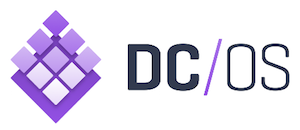
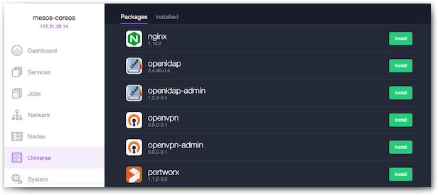
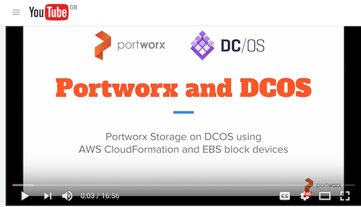

# Showcasing Portworx and DC/OS on Amazon




Install [Portworx Developer Edition](https://github.com/portworx/px-dev) onto a [DC/OS](https://dcos.io/) cluster running on vanilla [aws ec2 nodes](https://aws.amazon.com/ec2/)



Recently Portworx became part of Mesosphere Universe, the DC/OS app-store of container images that allow you to scale, update & upgrade complex services like Cassandra, Kafka, ElasticSearch and other stateful services. Using the Mesosphere Universe, you can install Portworx in your DC/OS cluster using a single command:

```bash
$ dcos package install --yes --options ./px-options.json portworx
```

This post is about why you would want to do that and how Portworx can help you run your mission critical stateful services on Mesosphere DC/OS.  We'll start with some background on Mesos, Marathon and DC/OS.  Feel free to skip that if you are already familar.

[](http://www.youtube.com/watch?v=O8Hyena9a8o)

[watch the introduction video](http://www.youtube.com/watch?v=O8Hyena9a8o)

[download the slides](slides.pdf)

## Background on Mesos, Marathon and DC/OS

Consumer facing services like Siri and Twitter run at un-imaginable scale and deployments often involve thousands of compute nodes.

A battle-proven, enterprise grade solution to orchestration at this scale is [Apache Mesos](http://mesos.apache.org/).  It pools compute nodes and makes them available to pluggable [frameworks](http://mesos.apache.org/documentation/latest/frameworks/) to use when deploying workloads.

[Marathon](https://mesosphere.github.io/marathon/) is a Mesos framework that will schedule Docker containers onto your cluster of compute nodes.  This frees up developers to concentrate on their `Dockerfile` and Marathon will think about what compute node to run the container(s).

[DC/OS](https://dcos.io/) is a packaged version of Mesos and Marathon (along with other tools) built by a company called [Mesosphere](https://mesosphere.com/).  It has a GUI and CLI to make the operation of a Mesos cluster running Marathon easier.  DC/OS includes an app-store of services that you can install with a single command called Universe. Portworx is available in the Mesosphere Universe.  We'll see how to install it below.

#### State{ less, full }

The Mesos/Marathon stack will work great if your entire workload is stateless (perhaps a Twitter bot or a Google Maps api client).  Quite often though, there is a process or two that will require persistent storage (perhaps a Postgres or Redis server).

Following the [12-factor manifesto](https://12factor.net/) we could run our stateful services as [pet's not cattle](https://blog.engineyard.com/2014/pets-vs-cattle) and install them on single-purpose static servers.

This seems like a shame, we have the full power of an industrial grade container scheduler but still have to manually operate some of our stack.

What if we had a tool that treated our heterogeneous compute cluster as a heterogeneous storage cluster too?

#### Portworx

Portworx storage offers a container aware storage fabric that will run on a commodity cluster of compute nodes.

This lets us schedule a stateful workload using Marathon and not worry if it ends up on node A, B or C - Portworx storage will provision a volume **before** the container starts (because of the low-level [Docker volume plugin](http://docs.portworx.com/run-with-docker-ent.html))

Because Portworx storage offers replication - we automatically have high-availability for our Postgres, Redis, MySQL or otherwise stateful container (if the container lands on another node - Portworx storage will ensure the data is there).

We can also take [snapshots](http://docs.portworx.com/snapshot.html) of existing volumes and then run other workloads against the snapshot volume.  For example, we could easily run a test-suite against a snapshot of production data only a few seconds old.

#### Compute AND storage

Mesos plays the role of the `kernel` in our cluster and Marathon that of the `init system`.  This allows us to treat a cluster of many nodes as one large computer.

Adding Portworx storage to this cluster means we now have a unified `storage` layer.  It knows where containers are and what volumes they need.  It will get the data volume in place before the container starts and constantly replicate data to other nodes without the container needing to know.

Unify your entire stack and deploy stateful containers alongside stateless processes to the same cluster using the same orchestration framework.

## Let's get to it!

[](http://www.youtube.com/watch?v=O8Hyena9a8o&t=3m50s)

[watch the workshop video](http://www.youtube.com/watch?v=O8Hyena9a8o&t=3m50s)

In this walkthrough of deploying and running Portworx on DC/OS, we will:

 * configure the [aws cli](https://aws.amazon.com/cli/)
 * create a [DC/OS](https://DC/OS.io/) cluster using [AWS CloudFormation](https://aws.amazon.com/cloudformation/)
 * setup nodes and attach block devices
 * deploy [etcd](https://github.com/coreos/etcd) and [marathon-lb](https://github.com/mesosphere/marathon-lb) using dcos
 * deploy [px-dev](https://github.com/portworx/px-dev) using DC/OS
 * explore our Portworx cluster using [pxctl](https://github.com/portworx/px-dev/blob/master/cli_reference.md)
 * deploy a stateful app
 * demonstrate HA by doing failover on the app
 * [snapshot](http://docs.portworx.com/snapshot.html) a volume
 * run a staging app against our snapshotted volume

## Create a dcos cluster

Following these steps assume you have have an OSX or Linux CLI and an [AWS account](https://aws.amazon.com/)

#### Install AWS cli

NOTE: you can skip this step if you already have a working `aws` command with configured access credentials.

First download and install the [aws cli](https://aws.amazon.com/cli/)

Then we configure the `aws` command with our access keys:

```bash
$ aws configure
```

Make note of the region you choose - for example this demo will be run inside `eu-west-1`.

You can get your AWS Access Key ID and AWS Secret Acess Key from the [Security Credentials](https://console.aws.amazon.com/iam/home#/security_credential) page of the AWS console.

Also - you will need to create a [key pair](console.aws.amazon.com/ec2/v2/home?#KeyPairs:sort=keyName) in the region you will run your stack.

NOTE: once you have downloaded a key-pair - change permissions and add it to your key-chain:

**in this example the key-pair I downloaded was called `kai-demos.pem`**

```bash
$ cd ~/.ssh
$ chmod 600 kai-demos.pem
$ ssh-add kai-demos.pem
```

#### Launch cloudformation stack

Now we will use cloud formation to launch a DC/OS cluster with 1 public and 3 private slaves.

Use the [cloud formation template](https://downloads.dcos.io/dcos/stable/aws.html) - and pick the `single master` configuration and the region you created/have a key pair for.

Click `Next` and configure the details for our stack:

 * call the stack `pxdemo`
 * choose the key pair you have for the region
 * change `OAuthEnabled` to false
 * change `SlaveInstanceCount` 3

Click `Next` and `Next` again.

Review the details and make sure you click the `AWS::IAM::Role` box at the bottom before you click `Create`.

The stack will start spinning up - it may take up to 10 minutes, you can keep an eye on the progress using the [CloudFormation screen](console.aws.amazon.com/cloudformation/home).

#### Install DC/OS CLI

Grab the URL of the Mesos master from the `Options` tab and copy it to your clipboard:

open this URL in a browser and you'll see the dcos dashboard

On the bottom left you will see the installation button for the DC/OS CLI - install this onto your laptop.

Now we can use the `dcos` cli to explore our cluster:

```bash
$ dcos node
```

## setup nodes

#### Clone repo

First we clone this repo so we can use `admin.sh` and the Marathon manifests.

```bash
$ git clone https://github.com/binocarlos/portworx-dcos.git
$ cd portworx-dcos
```

#### Check our instances

First - if the stack you created was not called `pxdemo` - export the `STACKNAME` variable:

```bash
$ export STACKNAME=my-custom-stackname
```

Now we can list the status of our nodes:

```bash
$ bash ./admin.sh describe-nodes
```

#### Setup nodes

Portworx requires a `shared` mount namespace setting for versions of Docker before 1.12 - this is so it can mount block devices from inside a container.

Also, we need a block device on each node dedicated to container storage.

```bash
$ bash ./admin.sh setup-docker
$ bash ./admin.sh create-volumes
```

Let's check that the block devices were attached.

```bash
$ bash ./admin.sh run-command lsblk
```

## Install DC/OS services

Portworx requires a key value store like [etcd](https://github.com/coreos/etcd) or [consul](https://www.consul.io/) so it can co-ordinate cluster state.

Also - so we can see our application from the outside world - we need to install [marathon-lb](https://github.com/mesosphere/marathon-lb) - a layer 7 load-balancer.

We will use the `dcos` cli to install both services onto our cluster.

```bash
$ dcos package install --yes etcd
$ dcos package install --yes marathon-lb
```

We can see the status of these services:

```
$ dcos service
$ dcos marathon app list
```

Wait for the etcd-server tasks and marathon-lb tasks to be running.

NOTE: in future, etcd will be installed automatically alongside portworx.

## Setup portworx

#### Create config

So the Portworx storage agents know where the etcd server lives - we need to pass a configuration file that includes the endpoint of the `etcd` server we just installed.

To generate this config:

```bash
$ bash admin.sh px-config
```

To write it to the correct file:

```bash
$ bash admin.sh px-config > px-options.json
```

#### Deploy portworx

Now we deploy portworx using DC/OS:

```bash
$ dcos package install --yes --options ./px-options.json portworx
```

Check the status of the portworx deployment:

```bash
$ dcos marathon app list
```

Wait for all 3 portworx tasks to be healthy.

### pxctl

Now we can explore our storage cluster - first let's login to one of the slaves:

```bash
$ bash admin.sh ssh-px-node
```

`pxctl` is installed onto the host as `/opt/pwx/bin/pxctl` - we can use it to operate our storage cluster:

```
core$ sudo /opt/pwx/bin/pxctl status
```

### Create shared volume

Now lets create a [shared volume](http://docs.portworx.com/shared-volumes.html) that we will use for our demo application:

```bash
$ sudo /opt/pwx/bin/pxctl volume create app-prod --shared --size 5 --repl 3
$ sudo /opt/pwx/bin/pxctl volume list
$ sudo /opt/pwx/bin/pxctl volume inspect app-prod
$ exit
```

## Deploy stateful application

We deploy the app manifest using marathon and wait for it to be ready:

```bash
$ dcos marathon app add app.json
$ dcos task
```

Now load the application in a browser and create some state.

```bash
$ open `bash admin.sh app-endpoint`
```

## HA failover

To simulate HA failover of our application container AND it's data - let's do a sneaky `docker rm -f` for the container.

```bash
$ bash admin.sh kill-app-container
```

Notice the DC/OS dashboard notice and re-schedule the container.

Let's check the node the `px-counter` app is running on.

```bash
$ dcos task
```
Repeat the `kill-app-container` until you can see the container has landed on a differnt node.

Now reload the URL in the browser and magic - our data is still there!

## Snapshots

Now we create a snapshot of the volume so we can run a CI test against it.

```bash
$ bash admin.sh ssh-px-node
core$ sudo /opt/pwx/bin/pxctl snap create --name app-ci-test app-prod
core$ sudo /opt/pwx/bin/pxctl snap list
```

Now create some more state in the production application in your browser so our production data and `app-ci-test` snapshot have diverged.

#### Deploy a test version of the app against the snapshot

Copy the following config file and save it in the same folder as `admin.sh` as a file called `app.test.json`:

```json
{
  "id": "px-counter-test",
  "container": {
    "type": "DOCKER",
    "docker": {
      "image": "binocarlos/px-counter:latest",
      "parameters": [{
         "key": "volume-driver",
         "value": "pxd"
      },
      {
         "key": "volume",
         "value": "app-ci-test:/data"
      }],
      "network": "BRIDGE",
      "portMappings": [
        { "hostPort": 0, "containerPort": 8080, "servicePort": 10001 }
      ],
      "forcePullImage": true
    }
  },
  "env": {
    "FILEPATH": "/data/items.json",
    "NODE_ENV": "test"
  },
  "instances": 1,
  "cpus": 0.1,
  "mem": 256,
  "healthChecks": [{
      "protocol": "HTTP",
      "path": "/",
      "portIndex": 0,
      "timeoutSeconds": 10,
      "gracePeriodSeconds": 10,
      "intervalSeconds": 2,
      "maxConsecutiveFailures": 10
  }],
  "labels":{
    "HAPROXY_GROUP":"external"
  }
}
```

We deploy this manifest using marathon and wait for it to be ready:

```bash
$ dcos marathon app add app.test.json
$ dcos task
```

Now open the test website in another browser tab.  To get the url use this command:

```bash
$ bash admnin.sh app-endpoint test
```

The test we ran should have added one more logo to the top-left of the screen.  This is an example of running a test-suite safely against production data!

We can see the logs of the test suite by running the following command:

```bash
$ dcos task log --lines 100 px-counter-test
```

## Conclusion
In this blog, we saw how to deploy and run Portworx via DC/OS Universe.  In the next blog post, we'll look at a real world senario for running Cassandra in production using Mesos, Marathon and Portworx.
